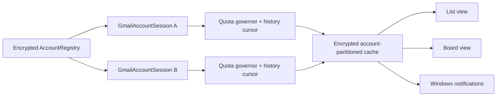

# Multi-account, incremental sync, and board view

**Status:** Approved
**Author:** Codex  **Date:** 2026-10-07

## Summary

GLook should remain a Gmail API/OAuth client, replace repeated folder snapshots with account-scoped Gmail history synchronization, and then build multi-account and board views on the same encrypted local mirror. POP cannot preserve Gmail labels or two-way state. Gmail IMAP can represent many labels, but it requires the full `mail.google.com` scope, does not cover Gmail settings/signatures, introduces a second synchronization model, and does not remove the need for OAuth verification. The proposed design makes each Gmail account an isolated session with its own credentials, history cursor, quota budget, cache namespace, notification state, and mailbox tree root. The existing list and new Kanban-style board become projections of one local model; changing views must not generate Gmail traffic.

## Goals

- Stay safely below Gmail's per-user, project, and daily quota boundaries and expose useful quota/sync status.
- Add multiple simultaneous Gmail accounts without any possibility of sending, deleting, labeling, or signing mail through the wrong account.
- Present every account as a collapsible top-level **Mailbox** with its own nested Gmail labels and unread count.
- Make **Sync All** synchronize every enabled mailbox, continue after an account failure, and report per-account progress.
- Add an optional Kanban-style mail view with user-editable workflow column names, switchable mailbox/Inbox scope, explicit Gmail label bindings, and moves that synchronize back to Gmail.
- Preserve the existing list view, reading pane, Gmail label hierarchy, signatures, notifications, and local encrypted cache.

## Non-goals

- Provider-neutral Outlook/Yahoo/custom IMAP support in this release.
- A web service or always-on cloud backend.
- Copying Kanmail code, assets, or styling. Kanmail is source-available under a restrictive license; GLook will independently implement the interaction concept with native WinUI controls.
- Closed-app push synchronization. Google's installed-device guidance still recommends polling; Gmail push requires Cloud Pub/Sub infrastructure and still feeds the same history synchronization path.
- A cross-account unified Inbox in the first multi-account slice. The architecture permits one later.

## Constraints

- Gmail currently documents 6,000 quota units per user/project/minute, 1,200,000 per project/minute, and an 80,000,000-unit project/day threshold. `history.list` costs 2 units, `threads.list` 10, `threads.get` 40, `messages.get` 20, and `labels.get` 1. [Official quota table](https://developers.google.com/workspace/gmail/api/reference/quota)
- The current five-minute refresh can cost approximately `label count + 2,021` units: labels and counts, 40 thread reads, and a second 10-thread notification scan. With the observed 285 labels, that is about 2,306 units per tick. The last Sync All shape—285 folders and roughly 1,626 distinct thread reads—would be about 68,000 units.
- Gmail history is normally available for at least a week but may expire sooner. A `history.list` 404 requires a bounded full resynchronization. [Gmail synchronization guide](https://developers.google.com/workspace/gmail/api/guides/sync)
- The app remains unpackaged WinUI 3 and local-only. Tokens and retained account configuration remain DPAPI-protected for the current Windows user.
- Gmail label membership is many-to-many. A card can legitimately have several labels; board moves must never silently pretend Gmail is folder-only.

## Proposed design

### 1. Keep Gmail API and change the synchronization algorithm

Each account persists a `historyId`. The first connection performs one bounded bootstrap of labels and recent mail, stores the newest history cursor, and constructs local label membership from message/thread label IDs. Subsequent automatic and manual refreshes call `history.list(startHistoryId)`, page through changes, retrieve only changed objects, update the encrypted cache transactionally, and persist the new cursor only after all pages succeed.

If the cursor is invalid, the account enters **Rebuilding local mirror**, performs a bounded bootstrap, and resumes history sync. Opening a folder first displays its local snapshot. If that label has never been hydrated or is explicitly refreshed, GLook loads a bounded recent page on demand; ordinary folder navigation does not reread 40 threads.

Notification detection uses added/changed messages carrying `INBOX` and `UNREAD` from the same history batch. This removes the separate unread-Inbox poll. Label counts are updated from changed label membership and reconciled lazily for system labels, expanded labels, and a low-frequency integrity pass rather than calling `labels.get` for every label every timer tick.

The Gmail history endpoint is the intended lightweight alternative to full polling and costs 2 units per page. An idle account at a five-minute interval is therefore approximately 192 units during an eight-hour day instead of roughly 221,000 units under the current upper-bound polling pattern.

### 2. Add a quota-aware sync coordinator

All Gmail calls go through an account-owned quota governor with Google's published method weights. The initial background budget is 4,500 units per rolling minute per account, reserving capacity for user actions. Priority is:

1. explicit send, draft, move, label, archive, and delete actions;
2. the selected mailbox/folder and message body requested by the user;
3. account history synchronization and notifications;
4. cache rebuilds and lazy older-mail hydration.

The coordinator honors `Retry-After`, uses truncated exponential backoff with jitter, prevents overlapping runs, and records estimated rolling-minute and daily project usage. Settings shows **Normal**, **Throttled**, **Waiting for Gmail**, or **Rebuild required**, plus the last successful sync per mailbox. These estimates are safeguards, not billing meters.

Automatic sync remains five minutes by default. Account starts receive jitter so several accounts do not fire together. **Sync All** means history-sync every enabled mailbox, initially sequentially, continuing when one account fails. **Rebuild mailbox cache** is a separate advanced action; it is never disguised as ordinary Sync All.

### 3. Isolate every account session

An encrypted `AccountRegistry` stores stable GUID, email, display name, ordering, accent key, sync/notification enablement, credential location, last history cursor, and sync state. Each account owns a `GmailAccountSession` containing its normal, settings, and permanent-delete Gmail clients, label-count cache, quota governor, and cancellation state.

Credentials are stored below `secure/accounts/{accountId}/`. OAuth storage keys remain separate within that directory. Removing one account deletes only that account's tokens, signature snapshot, sync metadata, and cache partition. It must never call the current store-wide `ClearAsync`.

The local SQLite schema already partitions rows by account hash, but the mutable global `SetAccountScope` is unsafe for concurrent accounts. Repository calls will either take `accountId` explicitly or use an immutable account-bound `AccountMailStore` wrapper.

Every actionable identity is composite:

```text
MailboxKey          = AccountId
MailboxFolderKey    = AccountId + LabelId
MailboxThreadKey    = AccountId + ThreadId
```

Compose, reply, forward, drafts, signatures, context menus, permanent deletion, and notification activation carry the originating `AccountId`. A new message exposes a From-account selector; replies and forwards default to and remain bound to the source account unless the user deliberately starts a new message elsewhere.



### 4. Mailbox tree and settings

The folder pane becomes:

```text
Mailboxes
  robert@example.com (12)
    Inbox
    Starred
    Sent
    Accounts
      Adobe
      Amazon
  sales@example.com (3)
    Inbox
    Starred
    Sent
    Customers
```

Mailbox roots expand independently and use stable keys such as `mailbox:{accountId}` and `folder:{accountId}:{labelId}` so identical Gmail label IDs cannot collide. Selecting a mailbox root opens its Inbox. Account identity uses email/display text plus a restrained accent; color is never the only differentiator.

Settings gains an **Accounts** section with Add account, Rename display label, Reauthorize, Remove, reorder, per-account automatic sync, and per-account notifications. A global synchronization section controls the default interval and includes **Sync all enabled mailboxes**. Advanced settings expose quota state and **Rebuild local mirror**.

### 5. Kanban-style board view

The current Outlook-style list remains the default. A native View selector offers **List** and **Board**. Switching uses cached data only.

A saved `BoardDefinition` contains a board name and ordered workflow columns. Each column has a user-editable display title independent from its Gmail label name. Renaming `Waiting on customer` to `Blocked`, for example, changes only the board heading; renaming the underlying Gmail label is a separate explicit action.

The Board command bar contains a **Mailbox** selector listing every connected account. Changing it immediately reprojects the same workflow against the selected account's cached Inbox and remembers the last mailbox used with that board. It does not trigger a full Gmail refresh. The first release displays one mailbox at a time; an **All mailboxes** choice is added only after cross-account isolation is proven.

Because Gmail label IDs differ between accounts, the reusable workflow definition and its account bindings are stored separately:

```text
BoardColumnDefinition = ColumnId + EditableTitle + Position + DragBehavior
BoardAccountBinding    = BoardId + AccountId + ColumnId + GmailLabelId
```

When a user selects a mailbox that has not yet been mapped to every column, the affected lane shows **Choose or create Gmail label** instead of silently creating or guessing a label. Inbox and other system-folder bindings are resolved automatically. Suggested starter workflow:

```text
Inbox  ->  Needs reply  ->  Waiting  ->  Done
```

Users can add, remove, reorder, and rename workflow columns from **Manage board**. Creating a column asks whether to bind an existing Gmail label or create a new one for the currently selected mailbox. Dragging a card defaults to **Move**: add the target label and remove the source workflow label. **Add label** is an explicit alternative and may intentionally leave the card visible in multiple columns. Done behavior is configurable—retain in Inbox, archive, or add a Done label—but is never inferred silently.

The WinUI surface uses a horizontal `ItemsRepeater`/scroll owner for lanes and a virtualized `ListView` within each 300–340 px lane. Each lane has independent vertical position, lazy hydration, count and sync state. The existing reading pane opens on the right when space permits or as an overlay at narrower widths. Lanes never compress below a readable width; narrower windows show horizontal scrolling or a single-lane selector.

Drag-and-drop is never the only input. Every card exposes keyboard-accessible **Move to** and **Add label** commands. Focus advances predictably after a move, a polite live region announces success/failure/rollback, and duplicate cards show why they appear in more than one lane. Account identity is written on each card and included in its automation name.

## Alternatives and tradeoffs

### Keep the current full-refresh API design

Lowest implementation effort, but repeated thread reads are the main quota consumer and multiply poorly across accounts and board columns. Rejected.

### Gmail API with history-based incremental synchronization

Preserves labels, Gmail thread identity, settings, signatures, mutations, narrow normal OAuth scope, and the current architecture while reducing idle work by orders of magnitude. Requires transactional cursors and a bounded rebuild path. **Recommended.**

### Gmail IMAP plus SMTP

Gmail's `X-GM-LABELS`, `X-GM-THRID`, Special-Use folders, and OAuth can support a Gmail-like client. [Gmail IMAP extensions](https://developers.google.com/workspace/gmail/imap/imap-extensions) However, IMAP requires full `mail.google.com` access for every account, still needs OAuth verification, is affected by IMAP connection/folder limits, does not manage Gmail signatures/settings, and creates a second sync/conflict engine. Reserve it for a future provider-neutral account type behind a transport interface; do not replace the Gmail backend now.

### POP plus SMTP

POP does not preserve labels, folder hierarchy, two-way state, or real-time multi-device synchronization. It cannot meet GLook's mirror contract. Rejected.

### Gmail Pub/Sub push

Push can reduce polling but requires cloud infrastructure, watch renewal, and a backend or pull subscription. Google recommends poll-based partial sync for installed/user-owned devices, and push still requires `history.list` to obtain changes. [Gmail push guide](https://developers.google.com/workspace/gmail/api/guides/push) Defer unless GLook later gains a service component.

## Risks

- **Wrong-account mutation:** fixed account sessions, composite IDs, and account-binding tests prevent it.
- **Cursor loss or partial apply:** update cursor and cache in one transaction; on failure replay the same history range.
- **History expiration:** detect 404, show rebuild state, and run bounded bootstrap without deleting authoritative Gmail data.
- **Daily project growth:** account-level governor plus project estimates; background work pauses before configured budget while interactive work remains available.
- **Board/Gmail inconsistency:** explicit Move versus Add label semantics and rollback UI after failed mutations.
- **Misleading custom headings:** board editing always exposes the bound Gmail label beneath the editable title; changing a title never renames or rebinds Gmail data.
- **Incomplete mailbox mapping:** unmapped lanes remain visibly unavailable until the user chooses or creates a label for that mailbox.
- **Cache migration:** legacy token and cache migration must be atomic and recoverable; never clear the existing credential until the new account session reconnects successfully.
- **Kanmail licensing:** use public product behavior only; do not copy source, assets, names, or visual treatment. [Kanmail license](https://github.com/Oxygem/Kanmail/blob/2.x/LICENSE.md)

## Rollout

1. Add quota accounting/telemetry and history-based sync for the existing single account. Keep old refresh behind a fallback flag until parity tests pass.
2. Introduce AccountRegistry, account-bound credential/cache/session APIs, and migrate the current account without reauthorization.
3. Add mailbox roots, Accounts settings, account-aware notifications/compose, and sequential Sync All across accounts.
4. Add account-specific Board view over cached data, saved boards, keyboard moves, and rollback behavior.
5. Add unified cross-account boards and optional unified Inbox only after isolation, quota, and accessibility tests pass.

Backout is staged: each slice preserves Gmail as authority and can fall back to the previous list projection. A migration backup remains until the new account reconnects and completes one successful history sync.

## Open questions

- None for the approved implementation scope. Unified cross-account boards and a future **All Inboxes** root remain later product decisions.

## Decision

Approved by the user on 2026-10-07. Implement Gmail history-based synchronization and quota governance first, isolated multi-account sessions and mailbox roots second, and an account-switchable Board view third. Board column display names are user-editable and independent of their explicit Gmail-label bindings. Board drag defaults to **Move**; **Add label** remains an explicit alternate action. Selecting a mailbox root opens that account's Inbox.
